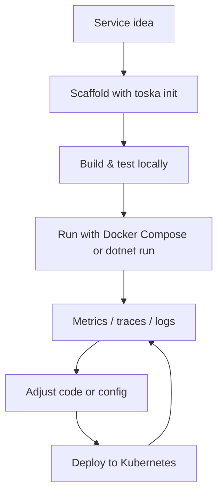
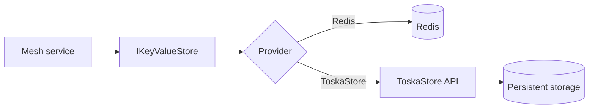

# Toska Mesh - C# Implementation

[](LICENSE)

**Maintained by [@nullsync](https://github.com/nullsync) at [Abstractive Machines LLC](https://github.com/abstractive-machines)**

ToskaMesh is a distributed service mesh and runtime for .NET 8. It provides the gateway, discovery plane, runtime hosts, and
operational services (auth, config, metrics, tracing) needed to build and run stateless or Orleans-backed stateful services with
consistent routing, security, and observability. This repo is the C# implementation ported from the original Elixir project and
includes a CLI for scaffolding and deployment.

## What ToskaMesh gives you
- Gateway and routing powered by YARP with health-aware load balancing and resilience policies.
- Discovery and registry through Consul and a gRPC-based registry surface.
- Runtime hosts (`MeshServiceHost` and `StatefulMeshHost`) that wire auth, telemetry, health checks, and service registration.
- Operational services for auth, config, metrics, and tracing to keep cross-cutting concerns consistent.
- Tooling and deployment assets: Toska CLI, Docker Compose, Helm, Kubernetes manifests, and Terraform.

## Why it is beneficial
- Standardizes service lifecycle behavior (register, route, observe, secure) without repeating boilerplate in every service.
- Supports both stateless APIs and stateful Orleans workloads behind a consistent runtime surface.
- Makes observability a default: Prometheus metrics, tracing, and structured logs are wired for you.
- Keeps infrastructure choices flexible (registry provider, key/value provider, deployment target).
- Speeds onboarding by giving a predictable layout and CLI-driven workflows.

## Where it accelerates delivery
### Development
- Scaffold stateless or stateful services with `toska init` and start coding immediately.
- Run locally with Docker Compose while keeping parity with production runtime behavior.
- Use the runtime hosts to focus on handlers/grains rather than plumbing.

### Deployment
- Build, push, and deploy with the Toska CLI or Helm charts in a single, repeatable flow.
- Use Terraform guides for EKS and production-ready defaults for health checks, metrics, and auth.
- Choose lightweight local runs or full Kubernetes deployments without changing service code.

### Iteration
- Consistent telemetry surfaces shorten the feedback loop from issue -> metric/trace -> fix.
- Config and auth services keep rollouts and policy changes centralized.
- Gateway routing + discovery metadata let you tune traffic without redeploying every service.

## Architecture at a glance

```mermaid
flowchart LR
    subgraph Mesh Control Plane
        Gateway[Gateway (YARP)]
        Discovery[Discovery + Registry\n(Consul / gRPC)]
        Ops[Mesh Services\n(Auth | Config | Metrics | Tracing)]
    end

    subgraph Service Runtime
        ServiceA[Service A\nstateless or Orleans-backed]
        ServiceB[Service B\nstateless or Orleans-backed]
        Runtime[ToskaMesh.Runtime\nMeshServiceHost / StatefulMeshHost]
    end

    ServiceA --> Runtime
    ServiceB --> Runtime
    Runtime -->|register + heartbeat| Discovery
    Gateway -->|routes via registry| ServiceA
    Gateway -->|routes via registry| ServiceB
    Runtime -->|telemetry + auth hooks| Ops
```



## ToskaStore: mesh-friendly key/value storage

ToskaStore is a lightweight HTTP/JSON key/value service that integrates with the `IKeyValueStore` abstraction in
`ToskaMesh.Runtime`. It is a first-class provider alongside Redis, enabling simple, language-agnostic storage for stateful
workflows or lightweight persistence needs.
For ToskaStore deployment details and API behavior, see the
[ToskaStore README](https://github.com/abstractive-machines/toska_store/blob/main/README.md).

**Benefits**
- HTTP/JSON API makes it easy to consume across languages and environments.
- Fits naturally into mesh deployments: run it as a Kubernetes Deployment/Service and point services at it.
- Supports TTLs and bulk fetch (`mget`), with optional key listing via `/kv/keys`.

**How it works in ToskaMesh**
- Select the provider with `Mesh:KeyValue:Provider = ToskaStore`.
- Configure the base URL and optional auth token under `Mesh:KeyValue:ToskaStore`.
- Enable the key index (`EnableKeyIndex=true`) when `/kv/keys` is not available; the runtime maintains a key list under
  `__keys` (or your custom `KeyIndexKey`).



Example configuration:

```json
{
  "Mesh": {
    "KeyValue": {
      "Provider": "ToskaStore",
      "ToskaStore": {
        "BaseUrl": "http://toskastore.toskamesh.svc.cluster.local:4000",
        "AuthToken": "replace-with-secret",
        "KeyPrefix": "profiles",
        "EnableKeyIndex": true
      }
    }
  }
}
```

Related guides: [docs/toskastore.md](docs/toskastore.md), the
[ToskaStore README](https://github.com/abstractive-machines/toska_store/blob/main/README.md), and the
[profile KV store demo](examples/profile-kv-store-demo/README.md).

## Quick start

### Install .NET 8 SDK
Install from https://dotnet.microsoft.com/download/dotnet/8.0 and confirm:
```bash
dotnet --version
```

### Install the CLI
```bash
cd tools/cli
./scripts/install-local.sh
# Add ~/Applications to PATH, or run directly: ~/Applications/toska
```

### Create a new service
```bash
toska init my-service --type stateless --style host
cd my-service
dotnet build
```

### Local development (Docker Compose)
```bash
export MESH_SERVICE_AUTH_SECRET="local-dev-mesh-service-secret-32chars"
export MESH_SERVICE_AUTH_ISSUER="ToskaMesh.Services"
export MESH_SERVICE_AUTH_AUDIENCE="ToskaMesh.Services"
cd deployments
docker-compose up -d postgres redis consul prometheus grafana gateway discovery
```

### Deploy to Kubernetes
```bash
cd my-service
toska validate                    # Check toska.yaml
toska build                       # Build Docker image
toska push                        # Push to registry
toska deploy                      # Apply to cluster
toska status                      # Check deployment status
```

Health checks: `curl http://localhost:5000/health` (gateway) and `curl http://localhost:5010/health` (discovery). Consul UI at `http://localhost:8500`.

Full quickstart: [docs/GETTING_STARTED.md](docs/GETTING_STARTED.md).

## CLI Reference

| Command | Description |
|---------|-------------|
| `toska init <name>` | Scaffold a new service (stateless/stateful) |
| `toska validate` | Validate toska.yaml manifest |
| `toska build` | Build Docker images |
| `toska push` | Push images to registry |
| `toska publish` | Build and push (combined) |
| `toska deploy` | Deploy to Kubernetes |
| `toska destroy` | Remove deployed resources |
| `toska status` | Show deployment status |
| `toska services` | List deployed services |
| `toska kubeconfig` | Generate kubeconfig from Talos |

See [tools/cli/README.md](tools/cli/README.md) for full CLI documentation.

## Documentation
- Docs index: [docs/README.md](docs/README.md) for architecture, operations, deployments, and plans.
- Runtime hosting: [docs/meshservicehost-quickstart.md](docs/meshservicehost-quickstart.md); samples under `examples/`.
- ToskaStore key/value guide: [docs/toskastore.md](docs/toskastore.md).
- Decisions and history: ADRs in [docs/adr/README.md](docs/adr/README.md); changelog index in [docs/CHANGELOG.md](docs/CHANGELOG.md) with entries in `changes/`.

## Repository layout
```
src/            # Core, services, and shared libraries
tests/          # Unit/integration tests
deployments/    # Docker Compose, Helm, Terraform, quickstarts
examples/       # Runnable samples (stateless/stateful)
docs/           # Guides, ADRs, plans, changelog
tools/cli/      # Toska CLI (Python)
```

## Common commands

### Using the CLI
```bash
toska init inventory-api --type stateless --style host    # New stateless service
toska init order-tracker --type stateful --stateful-template consul  # New stateful service
toska validate -f toska.yaml                              # Validate manifest
toska deploy --dry-run                                    # Preview deployment
toska deploy -v                                           # Deploy with verbose output
toska services --json                                     # List services as JSON
```

### .NET commands
```bash
dotnet restore ToskaMesh.sln
dotnet build ToskaMesh.sln -c Release
dotnet test ToskaMesh.sln
dotnet format
```

### Running from source
```bash
./run-gateway.sh
./run-discovery.sh
# Or: dotnet run --project src/Core/ToskaMesh.Gateway
```

## Security & configuration
- Keep secrets (JWT, connection strings, TLS material) out of source control; prefer `.env` or shell exports when using Docker Compose.
- Set `MESH_SERVICE_AUTH_SECRET` to a strong 32+ character value before running gateway/discovery; align issuer/audience across services.
- Ports and endpoints can be overridden via environment variables defined in `deployments/docker-compose.yml`.

## Contributing

See [CONTRIBUTING.md](CONTRIBUTING.md) for contribution guidelines.

## Security

See [SECURITY.md](SECURITY.md) for security policy and vulnerability reporting.

## License

Licensed under the Apache License 2.0. See `LICENSE` and `NOTICE` for details.

## Resources

- [.NET Documentation](https://docs.microsoft.com/dotnet/)
- [ASP.NET Core](https://docs.microsoft.com/aspnet/core/)
- [Orleans Documentation](https://docs.microsoft.com/dotnet/orleans/)
- [YARP Documentation](https://microsoft.github.io/reverse-proxy/)
- [OpenTelemetry .NET](https://opentelemetry.io/docs/instrumentation/net/)
- [Polly Documentation](https://github.com/App-vNext/Polly)
- `MeshServiceHost` quickstart: `docs/meshservicehost-quickstart.md`
- Runnable example service (NuGet consumer): `examples/hello-mesh-service`
- Runtime packaging: `docs/runtime-packaging.md`
