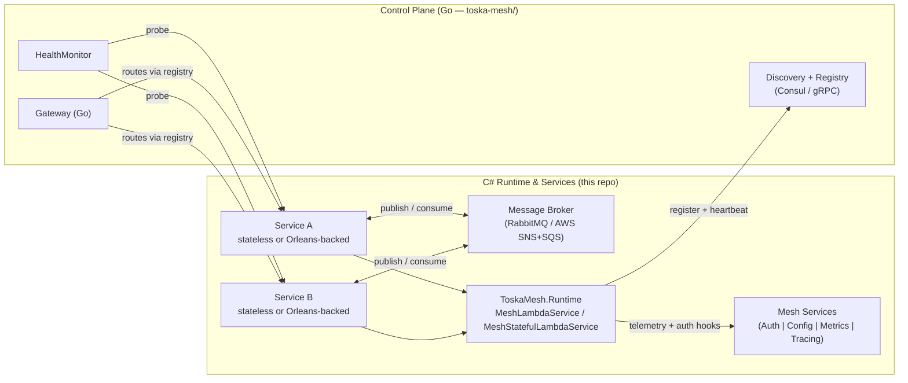
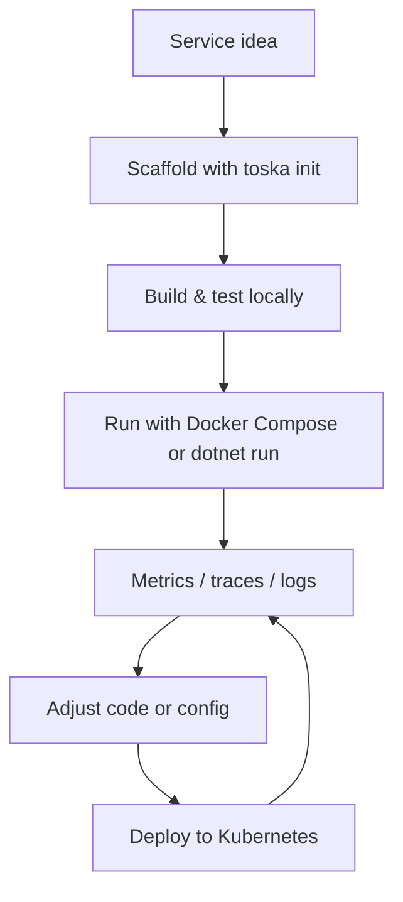
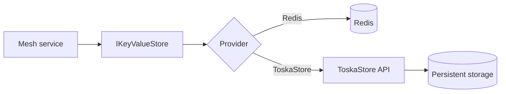

# ToskaMesh

[](https://github.com/abstractivemachines/toska-mesh-cs/actions/workflows/ci.yml)
[](LICENSE)

**Maintained by [@nullsync](https://github.com/nullsync) at [Abstractive Machines LLC](https://github.com/abstractivemachines)**

ToskaMesh is the C# runtime SDK and business services for the ToskaMesh service mesh. It provides runtime hosts, operational
services (auth, config, metrics, tracing), and messaging primitives needed to build and run stateless or Orleans-backed stateful
services with consistent security and observability. The control plane (Gateway, Discovery, HealthMonitor, Router) is written in
Go and lives in [`toska-mesh/`](../toska-mesh/). A Python-based CLI (`toska`) handles scaffolding, builds, and deployments.

## What this repo gives you
- Runtime hosts (`MeshLambdaService` and `MeshStatefulLambdaService`) that wire auth, telemetry, health checks, and service registration.
- Discovery client (gRPC and Consul-based `IServiceRegistry`) for registering with the Go Discovery service.
- Messaging and evented communication via MassTransit with RabbitMQ or AWS SNS/SQS transports, plus `IMeshRpc` for request/response over the broker.
- Operational services for auth, config, metrics, tracing, and observability to keep cross-cutting concerns consistent.
- NuGet packaging of the runtime libraries so external services can consume ToskaMesh without living in the monorepo.
- Tooling and deployment assets: Toska CLI, Docker Compose, Helm, Kubernetes manifests, and Terraform.

## Hello world

```csharp
await MeshLambdaService.RunAsync(
    app =>
    {
        app.MapGet("/hello", () => Results.Ok(new { message = "Hello from ToskaMesh" }));
    },
    options =>
    {
        options.Routing.Strategy = LoadBalancingStrategy.RoundRobin;
        options.Routing.HealthCheckEndpoint = "/health";
    },
    services =>
    {
        services.AddGrpcServiceRegistry(configuration);
    });
```

The service auto-registers with Discovery, wires telemetry and health checks, and becomes routable through the Gateway — no boilerplate needed. See [examples/hello-mesh-service](examples/hello-mesh-service) for the full runnable version.

## Why ToskaMesh

- Standardizes service lifecycle (register, route, observe, secure) without repeating boilerplate in every service.
- Supports both stateless APIs and stateful Orleans workloads behind a consistent runtime surface.
- Makes observability a default: Prometheus metrics, tracing, and structured logs are wired for you.
- Keeps infrastructure choices flexible — swap registry providers, key/value backends, or deployment targets without changing service code.
- Scaffold with `toska init`, run locally with Docker Compose, and deploy to Kubernetes with the same CLI.

## Architecture at a glance


```mermaid
flowchart LR
    subgraph Control Plane ["Control Plane (Go — toska-mesh/)"]
        Gateway["Gateway (Go)"]
        Discovery["Discovery + Registry\n(Consul / gRPC)"]
        HealthMon["HealthMonitor"]
    end

    subgraph This Repo ["C# Runtime & Services (this repo)"]
        Ops["Mesh Services\n(Auth | Config | Metrics | Tracing)"]
        Broker["Message Broker\n(RabbitMQ / AWS SNS+SQS)"]
        ServiceA[Service A\nstateless or Orleans-backed]
        ServiceB[Service B\nstateless or Orleans-backed]
        Runtime[ToskaMesh.Runtime\nMeshLambdaService / MeshStatefulLambdaService]
    end

    ServiceA --> Runtime
    ServiceB --> Runtime
    Runtime -->|register + heartbeat| Discovery
    HealthMon -->|probe| ServiceA
    HealthMon -->|probe| ServiceB
    Gateway -->|routes via registry| ServiceA
    Gateway -->|routes via registry| ServiceB
    Runtime -->|telemetry + auth hooks| Ops
    ServiceA <-->|publish / consume| Broker
    ServiceB <-->|publish / consume| Broker
```


```mermaid
flowchart TD
    Idea[Service idea] --> Scaffold[Scaffold with toska init]
    Scaffold --> Build[Build & test locally]
    Build --> Run[Run with Docker Compose or dotnet run]
    Run --> Observe[Metrics / traces / logs]
    Observe --> Iterate[Adjust code or config]
    Iterate --> Deploy[Deploy to Kubernetes]
    Deploy --> Observe
```

## ToskaStore: mesh-friendly key/value storage

ToskaStore is a lightweight HTTP/JSON key/value service that integrates with the `IKeyValueStore` abstraction in
`ToskaMesh.Runtime`. It is a first-class provider alongside Redis, enabling simple, language-agnostic storage for stateful
workflows or lightweight persistence needs.


```mermaid
flowchart LR
    Service[Mesh service] --> IKeyValueStore
    IKeyValueStore --> Provider{Provider}
    Provider -->|Redis| Redis[(Redis)]
    Provider -->|ToskaStore| ToskaStore[ToskaStore API]
    ToskaStore --> Storage[(Persistent storage)]
```

For configuration details, deployment instructions, and API behavior see
[docs/toskastore.md](docs/toskastore.md), the
[ToskaStore README](https://github.com/abstractivemachines/toska_store/blob/main/README.md), and the
[profile KV store demo](examples/profile-kv-store-demo/README.md).

## Prerequisites

- [.NET 10 SDK](https://dotnet.microsoft.com/download/dotnet/10.0)
- [Docker](https://docs.docker.com/get-docker/) and Docker Compose
- Python 3 (for the Toska CLI)
- (Optional) `kubectl` / `talosctl` for Kubernetes or Talos Linux deployments

## Quick start

### Install .NET 10 SDK
Install from https://dotnet.microsoft.com/download/dotnet/10.0 and confirm:
```bash
dotnet --version
```

### Install the CLI
```bash
cd tools/cli
./scripts/install-local.sh
# Add ~/Applications to PATH, or run directly: ~/Applications/toska
```

### Create a new service
```bash
toska init my-service --type stateless
cd my-service
dotnet build
```

### Local development (Docker Compose)
```bash
export MESH_SERVICE_AUTH_SECRET="local-dev-mesh-service-secret-32chars"
export MESH_SERVICE_AUTH_ISSUER="ToskaMesh.Services"
export MESH_SERVICE_AUTH_AUDIENCE="ToskaMesh.Services"
docker-compose up -d postgres redis consul prometheus grafana rabbitmq
```
The primary `docker-compose.yml` lives at the repository root. The Go control plane (Gateway, Discovery, HealthMonitor) runs separately — see [`toska-mesh/`](../toska-mesh/) for instructions.

### Deploy to Kubernetes (EKS, Talos Linux, or other clusters)
```bash
cd my-service
toska validate                    # Check toska.yaml
toska build                       # Build Docker image
toska push                        # Push to registry
toska deploy                      # Apply to cluster
toska status                      # Check deployment status
```

Health checks: `curl http://localhost:5000/health` (Go gateway, from `toska-mesh/`) and `curl http://localhost:8080/health` (Go discovery). Consul UI at `http://localhost:8500`.

Full quickstart: [docs/GETTING_STARTED.md](docs/GETTING_STARTED.md).

## CLI Reference

| Command | Description |
|---------|-------------|
| `toska init <name>` | Scaffold a new service (stateless/stateful) |
| `toska validate` | Validate toska.yaml manifest |
| `toska build` | Build Docker images |
| `toska push` | Push images to registry |
| `toska publish` | Build and push (combined) |
| `toska deploy` | Deploy to Kubernetes |
| `toska destroy` | Remove deployed resources |
| `toska status` | Show deployment status |
| `toska services` | List deployed services |
| `toska deployments` | List ToskaMesh user deployments |
| `toska kubeconfig` | Generate kubeconfig from Talos |

See [tools/cli/README.md](tools/cli/README.md) for full CLI documentation.

## Observability service

Run locally:
```bash
dotnet run --project src/Services/ToskaMesh.ObservabilityService
```

Key endpoints (default base URL depends on your launch configuration):

| Endpoint | Description |
|----------|-------------|
| `GET /observability/portal` | JSON portal index |
| `GET /observability/topology` | Service topology graph |
| `GET /observability/metrics/summary` | Aggregated metrics summary |
| `GET /observability/dashboards/service/{service}` | Per-service dashboard |
| `GET /observability/slo` | SLO overview for all services |
| `GET /observability/slo/{service}` | SLO detail for a single service |
| `GET /observability/alerts/burn-rate` | SLO burn-rate alerts |
| `GET /observability/releases` | Full release history |
| `POST /observability/releases` | Ingest a new release record |
| `POST /observability/releases/{id}/rollback` | Rollback a release |
| `GET /observability/playbooks` | List runbooks |
| `GET /observability/playbooks/{id}` | Fetch a single playbook |
| `GET /metrics` | Prometheus scrape target |

## Documentation
- Docs index: [docs/README.md](docs/README.md) for architecture, operations, deployments, and plans.
- Runtime hosting: [docs/meshlambdaservice-quickstart.md](docs/meshlambdaservice-quickstart.md); samples under `examples/`.
- Evented communication: [docs/evented-communication.md](docs/evented-communication.md).
- Monitoring and alerting: [docs/monitoring-setup.md](docs/monitoring-setup.md).
- ToskaStore key/value guide: [docs/toskastore.md](docs/toskastore.md).
- Migration guide (v0.1 to v0.2): [docs/migration-guide-v0.2.md](docs/migration-guide-v0.2.md).
- Decisions and history: ADRs in [docs/adr/README.md](docs/adr/README.md); changelog index in [docs/CHANGELOG.md](docs/CHANGELOG.md) with entries in `changes/`.

## Repository layout
```
src/
  Services/       # AuthService, ConfigService, MetricsService, TracingService, ObservabilityService
  Shared/         # Runtime (MeshLambdaService), Common, Grpc, Protocols, Security, Telemetry
tests/            # Unit/integration tests (mirrors src/ with .Tests suffix)
examples/         # Runnable samples (stateless, stateful, RPC, key-value)
deployments/      # Docker Compose, Dockerfiles, Prometheus/Grafana configs, Terraform
helm/             # Helm charts
k8s/              # Kubernetes manifests
tools/cli/        # Toska CLI (Python)
docs/             # Guides, ADRs, plans, changelog
```

## Examples

| Project | Description |
|---------|-------------|
| [hello-mesh-service](examples/hello-mesh-service) | Stateless service consuming ToskaMesh.Runtime via NuGet |
| [adder-mesh-service](examples/adder-mesh-service) | Minimal stateless service with a single `/add` endpoint |
| [todo-mesh-service](examples/todo-mesh-service) | Stateful Orleans silo + HTTP API, state in Redis via `IKeyValueStore` |
| [mesh-rpc-demo](examples/mesh-rpc-demo) | Three services chained via RabbitMQ request/response using `IMeshRpc` |
| [profile-kv-store-demo](examples/profile-kv-store-demo) | Profile API persisting data through `IKeyValueStore` backed by ToskaStore |
| [redis-grain-storage-demo](examples/redis-grain-storage-demo) | Stateful Orleans silo using Redis grain storage with local clustering |

## Testing

```bash
dotnet test ToskaMesh.sln                                              # Full suite
dotnet test tests/ToskaMesh.Security.Tests/ToskaMesh.Security.Tests.csproj  # Single project
```

## Security & configuration
- Keep secrets (JWT, connection strings, TLS material) out of source control; prefer `.env` or shell exports when using Docker Compose.
- Set `MESH_SERVICE_AUTH_SECRET` to a strong 32+ character value before running gateway/discovery; align issuer/audience across services.
- Ports and endpoints can be overridden via environment variables defined in `deployments/docker-compose.yml`.

## Contributing

See [CONTRIBUTING.md](CONTRIBUTING.md) for contribution guidelines.

## Security

See [SECURITY.md](SECURITY.md) for security policy and vulnerability reporting.

## License

Licensed under the Apache License 2.0. See `LICENSE` and `NOTICE` for details.

## Resources

- [.NET Documentation](https://learn.microsoft.com/dotnet/)
- [ASP.NET Core](https://learn.microsoft.com/aspnet/core/)
- [Orleans Documentation](https://learn.microsoft.com/dotnet/orleans/)
- [OpenTelemetry .NET](https://opentelemetry.io/docs/instrumentation/net/)
- [MassTransit](https://masstransit.io/)
- [Consul](https://developer.hashicorp.com/consul)
- [Talos Linux](https://www.talos.dev/)
- `MeshLambdaService` quickstart: [docs/meshlambdaservice-quickstart.md](docs/meshlambdaservice-quickstart.md)
- Runnable example service (NuGet consumer): [examples/hello-mesh-service](examples/hello-mesh-service)
- Runtime packaging: [docs/runtime-packaging.md](docs/runtime-packaging.md)
