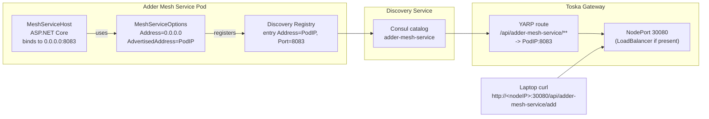

# Adder Mesh Service through Toska Gateway

## Notes on advertised vs. bind address

- Services bind to `0.0.0.0` inside the pod so port-forwarding, probes, and in-pod traffic work.
- The discovery service now rewrites non-routable registrations (`0.0.0.0`, loopback, or empty) to the caller's IP, so apps don't need to know their advertised address.
- You no longer need to set `Mesh__Service__AdvertisedAddress` (or `Mesh__Service__Address`) in the adder deployment; discovery normalizes it during registration and uses the caller IP as the advertised address. The gateway picks up that value when building routes.
