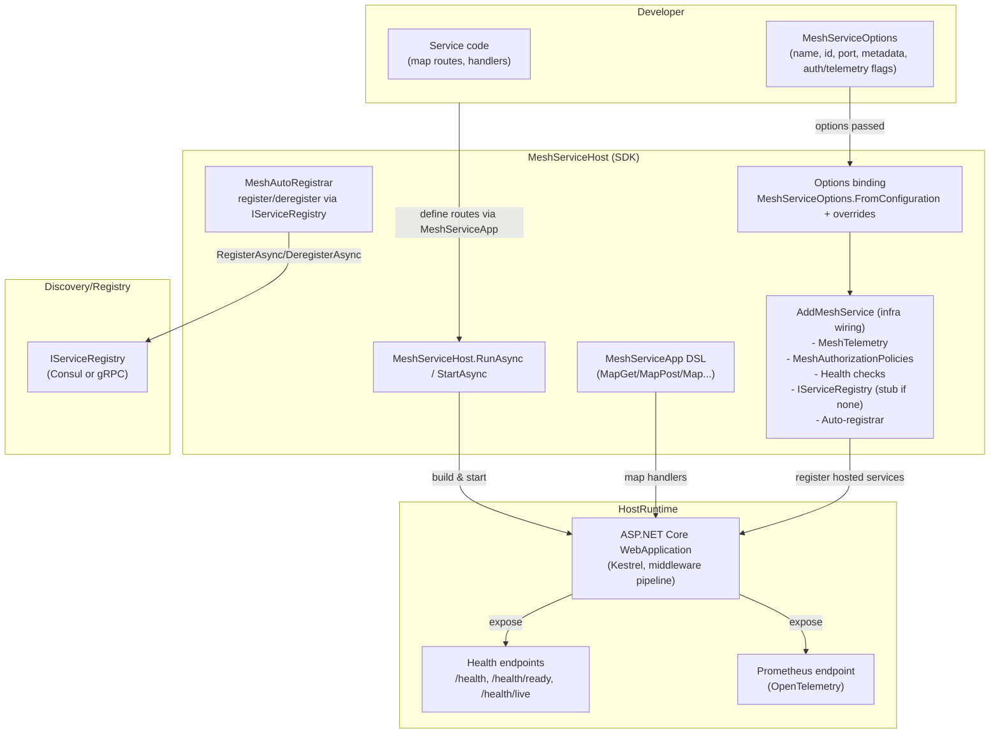

```mermaid
flowchart TD
    subgraph Developer
        D1["Service code\n(map routes, handlers)"]
        D2["MeshServiceOptions\n(name, id, port, metadata, auth/telemetry flags)"]
    end

    subgraph "MeshServiceHost (SDK)"
        H1["MeshServiceHost.RunAsync / StartAsync"]
        H2["MeshServiceApp DSL\n(MapGet/MapPost/Map...)"]
        H3["Options binding\nMeshServiceOptions.FromConfiguration + overrides"]
        H4["AddMeshService (infra wiring)\n- MeshTelemetry\n- MeshAuthorizationPolicies\n- Health checks\n- IServiceRegistry (stub if none)\n- Auto-registrar"]
        H5["MeshAutoRegistrar\nregister/deregister via IServiceRegistry"]
    end

    subgraph HostRuntime
        R1["ASP.NET Core WebApplication\n(Kestrel, middleware pipeline)"]
        R2["Health endpoints\n/health, /health/ready, /health/live"]
        R3["Prometheus endpoint\n(OpenTelemetry)"]
    end

    subgraph Discovery/Registry
        S1["IServiceRegistry\n(Consul or gRPC)"]
    end

    Developer -->|define routes via MeshServiceApp| H1
    D2 -->|options passed| H3 --> H4
    H1 -->|build & start| R1
    H2 -->|map handlers| R1
    H4 -->|register hosted services| R1
    H5 -->|RegisterAsync/DeregisterAsync| S1
    R1 -->|expose| R2
    R1 -->|expose| R3
```
