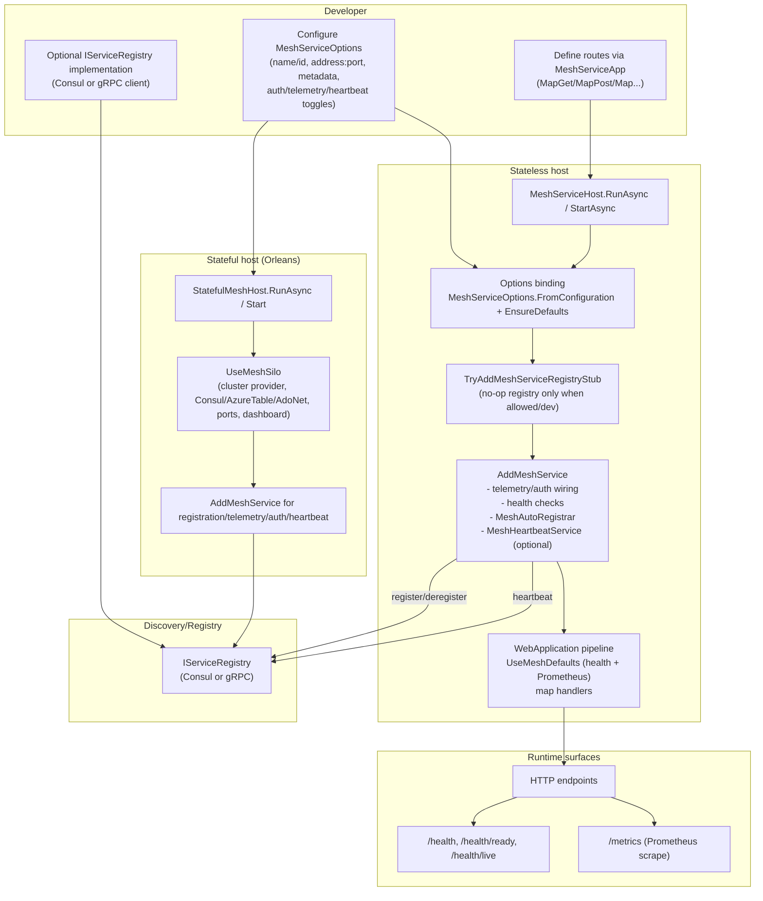

# MeshServiceHost runtime flow

```mermaid
flowchart TD
    subgraph Developer
        D1["Define routes via MeshServiceApp\n(MapGet/MapPost/Map...)"]
        D2["Configure MeshServiceOptions\n(name/id, address:port, metadata,\nauth/telemetry/heartbeat toggles)"]
        D3["Optional IServiceRegistry implementation\n(Consul or gRPC client)"]
    end

    subgraph "Stateless host"
        S1["MeshServiceHost.RunAsync / StartAsync"]
        S2["Options binding\nMeshServiceOptions.FromConfiguration + EnsureDefaults"]
        S3["TryAddMeshServiceRegistryStub\n(no-op registry only when allowed/dev)"]
        S4["AddMeshService\n- telemetry/auth wiring\n- health checks\n- MeshAutoRegistrar\n- MeshHeartbeatService (optional)"]
        S5["WebApplication pipeline\nUseMeshDefaults (health + Prometheus)\nmap handlers"]
    end

    subgraph "Stateful host (Orleans)"
        T1["StatefulMeshHost.RunAsync / Start"]
        T2["UseMeshSilo\n(cluster provider, Consul/AzureTable/AdoNet, ports, dashboard)"]
        T3["AddMeshService for registration/telemetry/auth/heartbeat"]
    end

    subgraph "Runtime surfaces"
        R1["HTTP endpoints"]
        R2["/health, /health/ready, /health/live"]
        R3["/metrics (Prometheus scrape)"]
    end

    subgraph "Discovery/Registry"
        Reg["IServiceRegistry\n(Consul or gRPC)"]
    end

    D1 --> S1
    D2 --> S2
    D2 --> T1
    D3 --> Reg
    S1 --> S2 --> S3 --> S4 --> S5 --> R1
    T1 --> T2 --> T3
    R1 --> R2
    R1 --> R3
    S4 -->|register/deregister| Reg
    S4 -->|heartbeat| Reg
    T3 --> Reg
```
