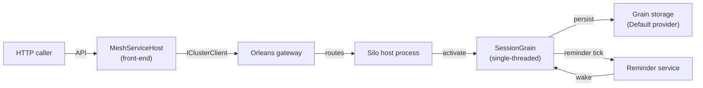

# Orleans grains in ToskaMesh

- Orleans gives us virtual actors (grains) with single-threaded execution per activation, persistence, and reminders. It is not a “spawn more threads per request” model; the runtime activates grains on demand, routes calls to the right silo, and handles placement/failover.
- Default storage provider name is `Default` (wired by `UseMeshSilo`): ADO.NET storage when `DatabaseConnectionString` is set, in-memory otherwise. Reminders use the same database when configured.
- Pair a stateful silo with a separate `MeshServiceHost` HTTP front-end that uses an Orleans client if you need public APIs; keep grains focused on entity/state logic.

## Flow (front-end to grain)



## Session grain example (state + persistence + reminder)

Interfaces and state:

```csharp
using Orleans;
using Orleans.Runtime;

public interface ISessionGrain : IGrainWithStringKey
{
    Task<SessionView> GetAsync();
    Task TouchAsync(string userAgent);
    Task ExpireAsync();
}

[GenerateSerializer]
public sealed class SessionState
{
    [Id(0)] public string SessionId { get; set; } = string.Empty;
    [Id(1)] public string UserAgent { get; set; } = string.Empty;
    [Id(2)] public DateTime LastSeenUtc { get; set; } = DateTime.UtcNow;
    [Id(3)] public bool IsExpired { get; set; }
}

public sealed record SessionView(string SessionId, string UserAgent, DateTime LastSeenUtc, bool IsExpired);
```

Grain implementation:

```csharp
using Orleans;
using Orleans.Runtime;

public class SessionGrain : Grain, ISessionGrain, IRemindable
{
    private readonly IPersistentState<SessionState> _state;
    private IGrainReminder? _expirationReminder;
    private static readonly TimeSpan IdleTtl = TimeSpan.FromMinutes(30);
    private static readonly TimeSpan ReminderPeriod = TimeSpan.FromMinutes(5);

    public SessionGrain(
        [PersistentState("session", "Default")] IPersistentState<SessionState> state)
    {
        _state = state;
    }

    public override async Task OnActivateAsync(CancellationToken cancellationToken)
    {
        if (!_state.RecordExists)
        {
            _state.State.SessionId = this.GetPrimaryKeyString();
            await _state.WriteStateAsync();
        }

        await EnsureReminderAsync();
    }

    public Task<SessionView> GetAsync()
    {
        var s = _state.State;
        return Task.FromResult(new SessionView(s.SessionId, s.UserAgent, s.LastSeenUtc, s.IsExpired));
    }

    public async Task TouchAsync(string userAgent)
    {
        _state.State.UserAgent = userAgent;
        _state.State.LastSeenUtc = DateTime.UtcNow;
        _state.State.IsExpired = false;
        await _state.WriteStateAsync();
        await EnsureReminderAsync();
    }

    public async Task ExpireAsync()
    {
        _state.State.IsExpired = true;
        await _state.WriteStateAsync();

        if (_expirationReminder is not null)
        {
            await UnregisterReminder(_expirationReminder);
            _expirationReminder = null;
        }
    }

    public async Task ReceiveReminder(string reminderName, TickStatus status)
    {
        if (_state.State.IsExpired)
        {
            return;
        }

        var idleFor = DateTime.UtcNow - _state.State.LastSeenUtc;
        if (idleFor >= IdleTtl)
        {
            await ExpireAsync();
        }
    }

    private async Task EnsureReminderAsync()
    {
        _expirationReminder ??= await RegisterOrUpdateReminder(
            reminderName: "session-expiration",
            dueTime: ReminderPeriod,
            period: ReminderPeriod);
    }
}
```

Hosting the silo with the built-in Orleans provider:

```csharp
using ToskaMesh.Runtime.Stateful;

await StatefulMeshHost.RunAsync(
    configureStateful: stateful =>
    {
        stateful.ServiceName = "session-silo";
        stateful.Orleans.ClusterId = "mesh-session";
        stateful.Orleans.ClusterProvider = StatefulClusterProvider.Consul;
        stateful.Orleans.ConsulAddress = "http://consul:8500";

        // Enable durable grain storage/reminders
        stateful.Orleans.DatabaseConnectionString =
            Environment.GetEnvironmentVariable("SESSION_DB");
        stateful.Orleans.DatabaseInvariant = "Npgsql";
    });
```

From a front-end `MeshServiceHost`, resolve `IClusterClient` and call `GetGrain<ISessionGrain>(sessionId)` to touch/read sessions. The grain keeps per-session state single-threaded, persists it via the configured store, and reminders clean up idle sessions without extra scheduler code.
