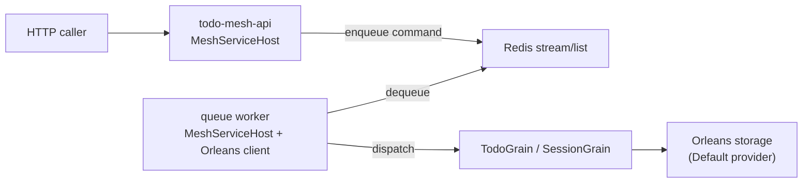

# Queue-to-grain dispatch (Redis + Orleans)

- Keep cross-service contracts message-based while still using Orleans grains for stateful logic. The API enqueues commands to Redis; a worker with an Orleans client dequeues and invokes grains.
- Use this when you want decoupled producers/consumers, retries/backpressure via the queue, and Orleans’ single-threaded per-entity execution for state.

## Flow



## API: enqueue command

Serialize a DTO and push to a Redis stream (or list). Example with `StackExchange.Redis`:

```csharp
app.MapPost("/todos/{id}", async (string id, TodoCommand cmd, IConnectionMultiplexer redis) =>
{
    var db = redis.GetDatabase();
    var payload = JsonSerializer.Serialize(new { Id = id, cmd.Title, cmd.Completed });

    await db.StreamAddAsync(
        key: "todo.commands",
        values: new[]
        {
            new NameValueEntry("type", "upsert"),
            new NameValueEntry("payload", payload),
        });

    return Results.Accepted();
});
```

## Worker: dequeue and call grains

Run a background worker with an Orleans client and Redis connection. Use a stream consumer group for fan-out and at-least-once delivery; forward to grains:

```csharp
public class CommandPump : BackgroundService
{
    private readonly IConnectionMultiplexer redis;
    private readonly IGrainFactory grains;
    private const string Stream = "todo.commands";
    private const string Group = "todo-workers";
    private const string Consumer = "worker-1";

    public CommandPump(IConnectionMultiplexer redis, IGrainFactory grains)
    {
        this.redis = redis;
        this.grains = grains;
    }

    protected override async Task ExecuteAsync(CancellationToken stoppingToken)
    {
        var db = redis.GetDatabase();
        _ = await db.StreamCreateConsumerGroupAsync(Stream, Group, "0-0", true);

        while (!stoppingToken.IsCancellationRequested)
        {
            var messages = await db.StreamReadGroupAsync(Stream, Group, Consumer, ">", count: 10);
            foreach (var msg in messages)
            {
                var payload = JsonSerializer.Deserialize<TodoCommandEnvelope>(msg["payload"]!);
                var grain = grains.GetGrain<ITodoGrain>(payload.Id);
                await grain.UpsertAsync(payload.Title, payload.Completed);
                await db.StreamAcknowledgeAsync(Stream, Group, msg.Id);
            }

            await Task.Delay(TimeSpan.FromMilliseconds(200), stoppingToken);
        }
    }
}

public record TodoCommandEnvelope(string Id, string Title, bool Completed);
```

Register the Orleans client and Redis in `MeshServiceHost` (or a generic host) similarly to the todo API, then add `CommandPump` as a hosted service.

## How this differs from direct grain calls

- **Decoupling:** Producers never reference Orleans types; they just enqueue DTOs. Workers own Orleans client configuration and retry semantics.
- **Backpressure/retries:** Redis streams/lists handle at-least-once delivery and consumer groups; you can scale workers horizontally without changing producers.
- **State model:** Grains still give you per-entity single-threaded execution and persistence. The queue just changes how work is delivered.

## IKeyValueStore vs grains

- `IKeyValueStore` (Redis-backed) is simple key/value access with no concurrency model, lifecycle, or reminders; callers must coordinate updates and contention themselves.
- Grains hold state in memory, serialize execution per grain instance, and can persist + schedule reminders. They’re better for coordination and consistency; `IKeyValueStore` is best for shared cache/config blobs or ephemeral data where you don’t need Orleans’ execution model.
