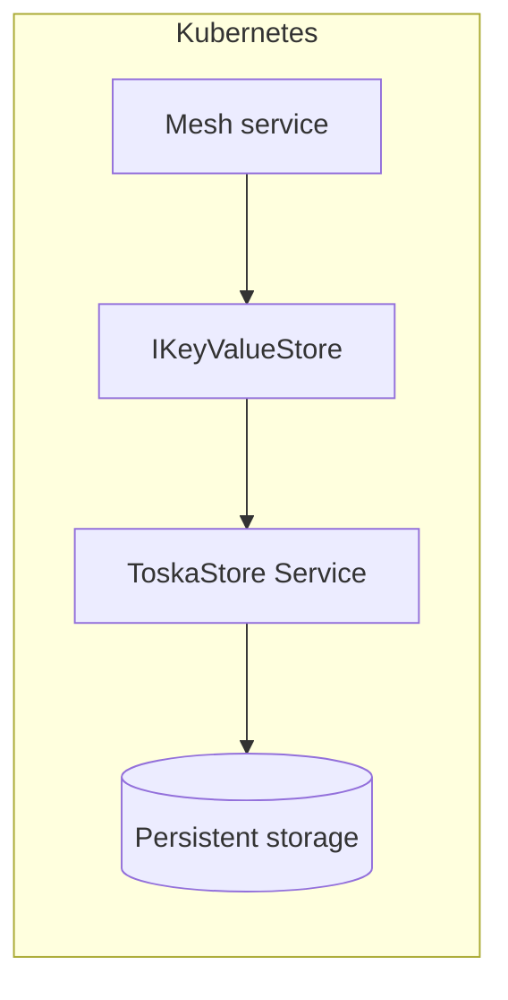

# ToskaStore with ToskaMesh

ToskaStore is a lightweight HTTP/JSON key/value service that can act as the `IKeyValueStore` provider for ToskaMesh services.
It is a good fit when you want a language-agnostic store with a simple API surface, or when you prefer an HTTP-backed service
over a direct Redis dependency.
See the upstream [ToskaStore README](https://github.com/abstractivemachines-com/toska_store/blob/main/README.md) for deployment and API details.

## What ToskaStore provides
- HTTP/JSON CRUD for keys with TTL support.
- Bulk fetch via `POST /kv/mget`.
- Optional key listing via `GET /kv/keys?prefix=...` (when available).

## How ToskaMesh integrates with ToskaStore
- The runtime exposes `IKeyValueStore` for stateless services and stateful hosts.
- Provider selection is controlled via `Mesh:KeyValue:Provider` (`Redis` or `ToskaStore`).
- The key prefix defaults to the service name; override with `Mesh:KeyValue:ToskaStore:KeyPrefix`.
- When `/kv/keys` is unavailable, set `EnableKeyIndex=true` so the runtime maintains a key index under `__keys`
  (or your configured `KeyIndexKey`).



## Configuration

`appsettings.json` example:

```json
{
  "Mesh": {
    "KeyValue": {
      "Provider": "ToskaStore",
      "ToskaStore": {
        "BaseUrl": "http://toskastore.toskamesh.svc.cluster.local:4000",
        "AuthToken": "replace-with-secret",
        "KeyPrefix": "profiles",
        "EnableKeyIndex": true,
        "KeyIndexKey": "__keys"
      }
    }
  }
}
```

Environment variable equivalents:

```bash
export Mesh__KeyValue__Provider=ToskaStore
export Mesh__KeyValue__ToskaStore__BaseUrl=http://toskastore:4000
export Mesh__KeyValue__ToskaStore__AuthToken=replace-with-secret
export Mesh__KeyValue__ToskaStore__EnableKeyIndex=true
```

## Kubernetes deployment pattern
- Deploy ToskaStore as its own `Deployment` + `Service` (ClusterIP is typical).
- Point mesh services at the in-cluster DNS name (for example:
  `http://toskastore.toskamesh.svc.cluster.local:4000`).
- Store the auth token in a Kubernetes `Secret` and map it to
  `Mesh__KeyValue__ToskaStore__AuthToken`.
- Use per-service key prefixes to keep multi-service data sets isolated.

## Examples
- `examples/profile-kv-store-demo/README.md` shows a full ToskaStore-backed mesh service.
